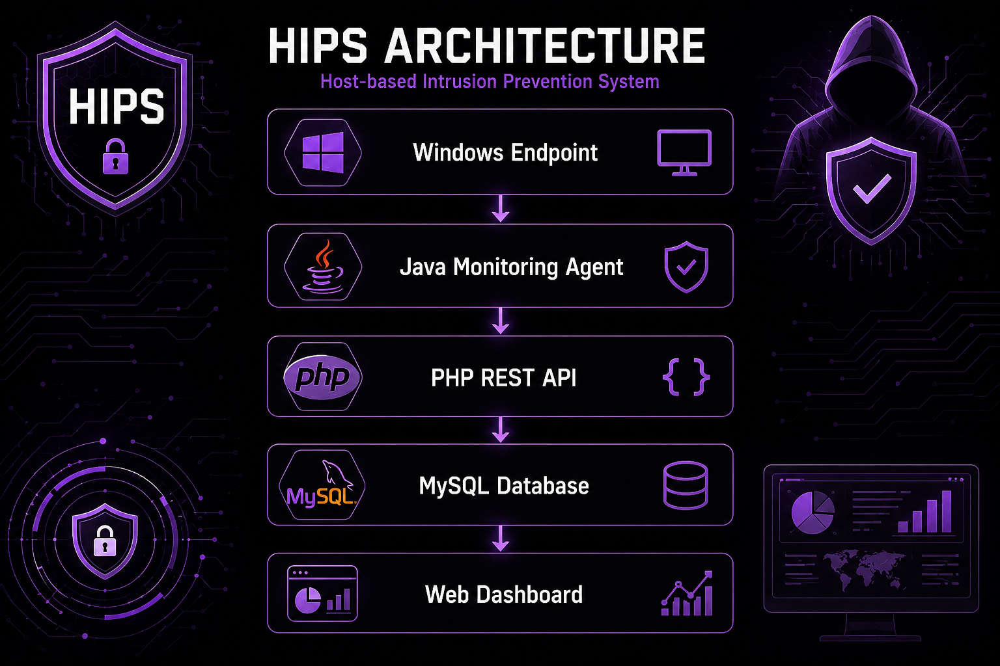
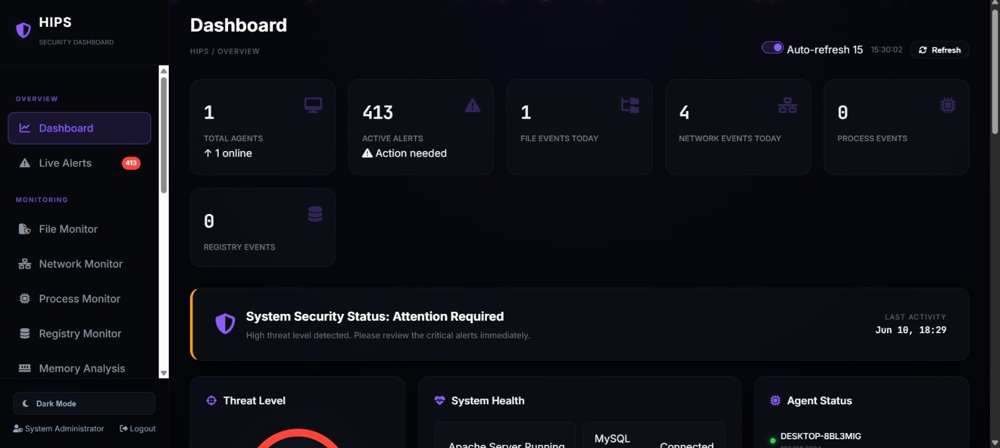
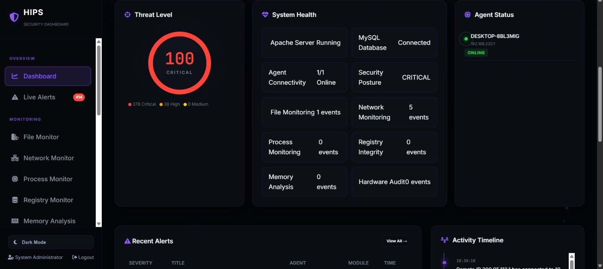
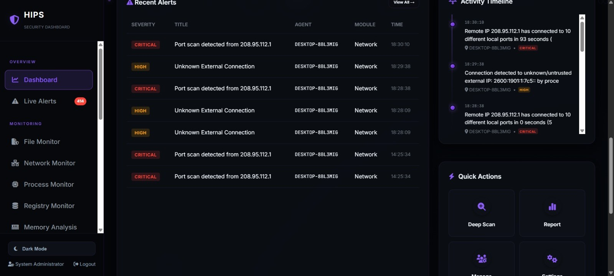
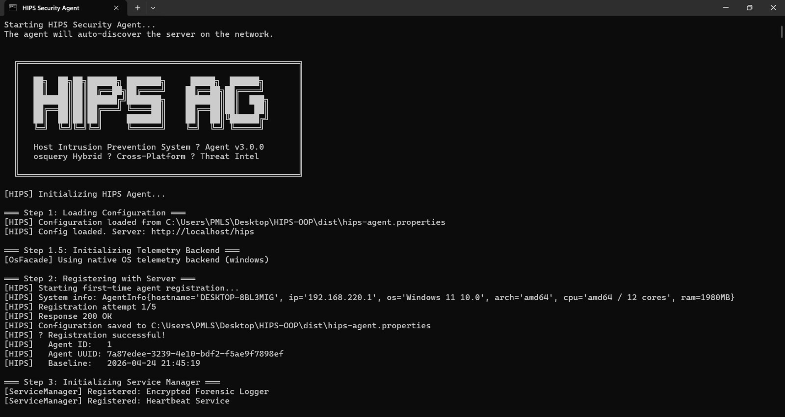

# HIPS-Host-Intrusion-Prevention-System
Enterprise-style Host Intrusion Prevention System featuring file integrity monitoring, network threat detection, behavioral analysis, and MITRE ATT&amp;CK mapping.

## Key Features

- Real-Time File Integrity Monitoring
- Network Threat Detection
- Behavioral Analysis
- MITRE ATT&CK Mapping
- Security Alerting
- Audit Logging

## Technology Stack

- Java
- PHP REST API
- MySQL
- HTML/CSS/JavaScript

## Architecture

## Screenshots

### Dashboard

### Threat Detection

### Agent

### SETUP
📖 [View Setup Guide](https://saim-sec-dev.github.io/HIPS-Host-Intrusion-Prevention-System/)
